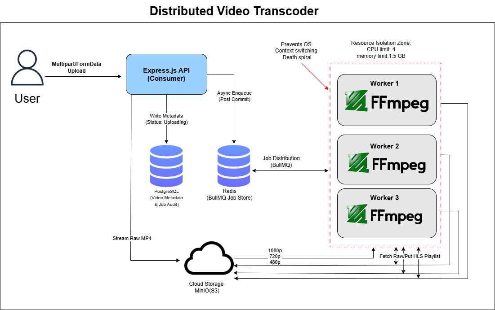

# Scalable Distributed Video Uploader

A production-ready video ingestion and processing system architected for high-throughput workloads.

The system implements a decoupled, event-driven architecture using MinIO (S3-compatible storage) and BullMQ (Redis-backed queue). By offloading compute-intensive transcoding to independent workers, the API remains highly responsive.

A key feature is the Transactional Integrity Layer powered by PostgreSQL, which synchronizes file storage, database metadata, and job enqueuing into atomic operations. This ensures fault tolerance and prevents data inconsistency (Ghost Jobs) across the distributed services, even under sustained network or hardware




## Features

* **MinIO Integration**
  Used S3-compatible object storage for high availability and stateless services instead of local storage.

* **Persistent WSL Volumes**
  Implemented Docker bind mounts so transcoded assets persist across container restarts.

* **HLS / ABR Pipeline**
  Automated conversion of raw MP4 uploads into HLS playlists (`.m3u8`) and segments (`.ts`) for adaptive browser playback.

* **Fault-Tolerant Workers**
  BullMQ workers perform FFmpeg processing with retries and exponential backoff.

* **Resumable Chunks:** Uses the TUS protocol to resume uploads after network failure.

* **Multipart Uploads:** Efficient large file streaming directly to object storage.

* **Worker-Based Transcoding:** Decouples uploading from processing using a message queue.

* **Horizontal Scalability:** Stateless API design allows for easy scaling via Kubernetes or ECS.

* **Progress Tracking:** Real-time feedback via WebSockets or polling.


##  High-Level Architecture

### Monorepo & Service Architecture
The system is organized as a high-performance monorepo using npm workspaces. This architecture decouples the entry points (API) from the heavy compute (Worker) and the persistence layer (Postgres).

* @aether/infra: Internal workspace for database migrations and shared connection pooling logic for PostgreSQL.

* @aether/utils: Core logic for MinIO object streaming and BullMQ queue definitions.

* **services/api:** Express.js producer service. It acts as the gateway for video ingestion and executes the Atomic Handoff—a transactional sequence that synchronizes Postgres records with Redis job states.

* **services/worker:** Dedicated transcoding consumer. It implements a "Claim & Process" pattern, pulling raw assets from MinIO and reporting real-time status updates back to the central database.

* **Docker Compose:** Orchestrates the interaction between the Node.js services and the infrastructure backbone (Postgres, Redis, and MinIO).

### Ingestion Layer
The flow has been hardened to ensure data integrity:

1. **Request Reception**  
   API receives high-resolution video via Multer.

2. **Metadata Intent**  
   An initial record is created in Postgres with an `uploading` status.

3. **Storage Transfer**  
   Payload is streamed directly to the MinIO `raw/` bucket.

4. **Atomic Handoff**

   - Opens a dedicated Postgres client connection.
   - Updates video status to `pending`.
   - Inserts a new row in `transcoding_jobs` with a link to the video.
   - Pushes the transcode job to BullMQ using the `videoId` as a unique `jobId`.
   - Captures the BullMQ ID and stores it in Postgres.
   - Commits the transaction only if all steps succeed.

###  Job Orchestration
- Redis-backed BullMQ queue
- Job state transitions:
  `Waiting → Active → Completed / Failed`
- Automatic stalled-job detection
- Configured retries with exponential backoff

### Reliability & Atomicity

This pipeline is designed with reliability as a first-class concern. Instead of treating the database, storage layer, and queue as loosely connected steps, the system performs a **coordinated handoff** between them to prevent inconsistent states.

At the core of this design is a **PostgreSQL transaction boundary** that ensures critical state transitions happen atomically from the application's perspective. During the upload flow, the system:

1. Creates the video metadata record.
2. Registers a transcoding job entry.
3. Enqueues the processing task in the BullMQ queue.

These steps form a **controlled commit point** for the pipeline. If any stage fails—such as the queue being unavailable, the job enqueue operation failing, or an unexpected runtime error—the transaction is **rolled back entirely**. This guarantees that partial states do not persist in the database.

### Why this matters

Without transactional coordination, distributed systems commonly suffer from the **dual-write problem**, where multiple subsystems are updated independently. A failure between those updates can lead to inconsistent states such as:

- **Orphaned jobs** – queue tasks referencing database records that never committed.
- **Zombie records** – database rows indicating work exists, but no worker will ever process them.
- **Silent data loss** – tasks that should exist but were never enqueued.

By enforcing a transactional boundary around the metadata and job creation logic, the system ensures the following invariant:
Either:
```
(video record + transcoding job + queue task exist)
```
Or:
none of them exist


### Failure Handling

If the queue layer (BullMQ / Redis) becomes unavailable during the enqueue operation:


enqueue fails
↓
transaction rollback
↓
no video state transition committed


This prevents the pipeline from entering an inconsistent state where the database believes work exists but no worker will ever receive it.

### Operational Benefits

This approach provides several practical reliability guarantees:

- **Strong consistency at job creation time**
- **No zombie or orphaned records**
- **Safe retries from the API layer**
- **Clear failure semantics for monitoring and observability**

In practice, this pattern acts as a **bulletproof handoff between persistence and asynchronous processing**, ensuring that every accepted upload is either fully scheduled for processing or cleanly rejected without leaving behind inconsistent system state.

###  Distributed Processing
- Worker pulls job from queue
- Downloads asset from MinIO
- Executes FFmpeg pipeline
- Streams progress via `stderr` parsing
- Uploads processed HLS assets to `processed/` bucket

###  Delivery
- Frontend streams `.m3u8` master playlist
- HLS segments (`.ts`) served via MinIO or CDN

## System Flow Diagram

```mermaid
  flowchart TD
    Client -->|1. Upload| API
    API -->|2. Record Intent| Postgres
    API -->|3. Store Raw| MinIO
    API -->|4. Atomic Enqueue| Redis
    Redis -->|5. Claim Job| Worker
    Worker -->|6. Log Progress| Postgres
    Worker -->|7. Process| FFmpeg
    Worker -->|8. Store HLS| MinIO
    Client -->|9. Poll Status| API
    API -->|10. Fetch Status| Postgres
  ```

## Tech Stack

| Component      | Technology            | Role                               |
| -------------- | --------------------- | ---------------------------------- |
| Backend        | Node.js (ESM)         | API & orchestration                |
| Object Storage | MinIO (S3-compatible) | Storage for raw & processed assets |
| Message Queue  | Redis + BullMQ        | Job scheduling & worker management |
| Processing     | FFmpeg                | Video transcoding & segmentation   |
| Infrastructure | Docker + WSL2         | Containerized runtime & fast I/O   |
| Persistence    | PostgresSQL           | Source of Truth for video metadata and job audit logs|


## The Transcoding Pipeline (ABR)

To provide a YouTube-like experience, this project implements **Adaptive Bitrate Streaming (ABR)**. Instead of serving a single MP4, we transform the source into an HLS (HTTP Live Streaming) format.


* **Multi-Resolution Scaling:** Using a single-pass `filter_complex`, we split the input into 1080p, 720p, and 480p streams.
* **Mathematical Constraints:** Implemented scaling logic (`scale=w=trunc(oh*a/2)*2`) to ensure all dimensions are even, satisfying H.264 encoder requirements.
* **HLS Segmentation:** Slices video into 10-second `.ts` chunks, enabling users to jump to any part of the video instantly without downloading the whole file.


## Distributed Worker Logic

The system is designed to be **fault-tolerant** and **memory-efficient**:

* **BullMQ State Machine:** Jobs move through `Waiting -> Active -> Completed/Failed` states. If a worker crashes, BullMQ detects the "stalled" job and re-queues it.
* **Stream-Based Processing:** We use Node.js `spawn` rather than `exec`. This allows us to pipe FFmpeg's `stderr` to track progress in real-time while maintaining a flat memory footprint (no RAM buffering).
* **Atomic Retries:** Configured with exponential backoff to handle transient issues like file-system locks or temporary CPU spikes.

* **Idempotent Job IDs:** Uses `videoId` as the BullMQ `jobId`, ensuring that the same video cannot be scheduled for transcoding more than once. This provides natural **concurrency control** and prevents duplicate processing even if the API retries or multiple workers attempt to enqueue the same task.

* **Self-Healing Retries:** Workers implement **exponential backoff retry logic**. If a worker pod crashes or is terminated mid-transcode, BullMQ automatically returns the job to the queue and retries it after a delay. This allows the system to recover gracefully from transient failures such as container restarts, node crashes, or temporary resource exhaustion.

* **Zombie Detection (Upcoming):** Planned monitoring logic will periodically scan for jobs stuck in a `processing` state beyond an expected timeout window. These **zombie jobs**—often caused by abrupt container exits or unhandled worker crashes—will be automatically reset or re-queued to ensure the pipeline continues processing without manual intervention.


# Key API Endpoints

| Method | Endpoint | Description |
| :--- | :--- | :--- |
| POST | `/api/v1/videos` | Ingests a raw video file, stores metadata, and triggers the transcoding pipeline. |
| GET | `/api/v1/videos/:id` | Returns video metadata including title, status, and the generated HLS playlist URL for streaming. |
| GET | `/api/v1/videos/:id/status` | Provides real-time processing status and transcoding progress for the video. |

#  Quick Start — Dockerized Monorepo

### Architecture Overview

Services included:

- **Video API** — Handles upload requests
- **Transcoding Worker** — Processes videos using FFmpeg
- **Redis** — Queue / messaging layer
- **MinIO** — Object storage (S3-compatible)

All services communicate internally using Docker service names (e.g., `http://minio:9000`).


### 1. Clone the Repository

```bash
git clone https://github.com/DipHldr/scalable_file_uploader.git
cd scalable_file_uploader
````


### 2. Environment Configuration

Create a `.env` file in the project root:

```env
# -----------------------------
# MinIO Configuration
# -----------------------------
MINIO_ENDPOINT=minio
MINIO_ROOT_USER=demo_user
MINIO_ROOT_PASSWORD=your_secure_password

# -----------------------------
# PostgreSQL Credentials
# -----------------------------
DB_USER=user
DB_PASSWORD=password
DB_NAME=database_name
DB_PORT=port_number

# DB Connection Host
DB_HOST=db

# -----------------------------
# Redis Configuration
# -----------------------------
REDIS_HOST=redis
REDIS_PORT=6379

# -----------------------------
# API Configuration
# -----------------------------
PORT=3000
```

These variables are automatically injected into containers by Docker Compose.


### 3. Launch the Infrastructure

From the project root:

```bash
docker-compose -f infra/docker-compose.yml up --build -d
```
OR you can do this if .env doesnt load in the **docker-compose.yml**
```bash
docker compose --env-file .env -f infra/docker-compose.yml watch
```

any way i have already added a few of these in the monorepo root script
```bash
npm run dev //-->standard image build 
OR 
npm run watch //--> runs in watch mode
OR
npm run down //--> deletes the containers
```

### What This Command Does

*  Builds API and Worker images using the monorepo context
*  Creates a private Docker network
*  Enables internal service-to-service communication
*  Mounts persistent volumes for MinIO
*  Starts Redis for job queue handling

Wait until logs show all services are healthy.


### 4. Service Access Points

| Service        | URL                                             | Credentials                         |
| -------------- | ----------------------------------------------- | ----------------------------------- |
| Video API      | http://localhost:3000                          | N/A                                 |
| MinIO Console  | http://localhost:9001                          | `demo_user / your_secure_password`  |
| Redis          | localhost:6379                                 | N/A                                 |
| PostgreSQL     | localhost:5432                                 | `postgres / your_secure_password`   |
### 5. Test the Processing Pipeline

1. Open **Postman**
2. Send a `POST` request to:

```
http://localhost:3000/api/v1/videos
```

3. Select **form-data**
4. Add a key:

   * `video` (type: File)
   * Attach a video file


### What Happens Next?

1. API uploads the file to MinIO
2. A job is pushed into Redis
3. The Worker consumes the job
4. FFmpeg starts transcoding
5. Progress logs stream in real-time in your terminal


### Stopping the Infrastructure

To stop all services:

```bash
docker-compose -f infra/docker-compose.yml down
```

To remove volumes as well:

```bash
docker-compose -f infra/docker-compose.yml down -v
```

## Horizontal Scaling

This architecture supports horizontal scaling out of the box.

Because the API is stateless and workers consume from a shared Redis-backed BullMQ queue, we can scale services independently.

---

### Scaling Worker Replicas

To increase transcoding throughput:

```bash
docker-compose -f infra/docker-compose.yml up --scale worker=3 -d
```

* This launches multiple worker containers consuming from the same queue.
* Jobs are automatically distributed
* No duplicate processing
* BullMQ handles locking and concurrency

we can verify running containers:
```bash
docker ps
```

## Scaling API Replicas
```bash
docker-compose -f infra/docker-compose.yml up --scale api=2 -d
```

##  Notes

* All services are isolated inside Docker.
* No external Redis or MinIO installation is required.
* Internal communication uses container service names, not `localhost`.
* Persistent storage ensures MinIO data survives container restarts.
* Performance Note: The system is configured with a Postgres connection pool (max: 20) and optimized for high-ingress metadata handling by keeping database transactions as short as possible (sub-50ms), decoupling them from the long-running binary uploads

## Transcoding Pipeline Details

Worker FFmpeg configuration optimized for web delivery:

* Video Codec: `libx264`
* Audio Codec: `aac`
* Segment Length: `10s` (`-hls_time 10`)
* Playlist Type: `VOD` (`-hls_list_size 0`)

Output:

* Master Playlist `.m3u8`
* Resolution Playlists
* `.ts` Segments


## Important Notes for WSL Users

If accessing the API from Windows tools (Postman / browser):

Use WSL IP address **or enable mirroring mode**:

```ini
[wsl2]
networkingMode=mirrored
```

Restart WSL:

```bash
wsl --shutdown
```


## Contributing
* Contributions are welcome!

## Project Motivation

This project was built to explore real-world backend system design concepts:

* Stateless microservice architecture
* Distributed job processing
* Media pipeline orchestration
* Object storage integration
* Production-style infrastructure workflows

It serves as a foundation for scaling toward production-grade video platforms.


## License
* Distributed under the MIT License. See LICENSE for more information.
